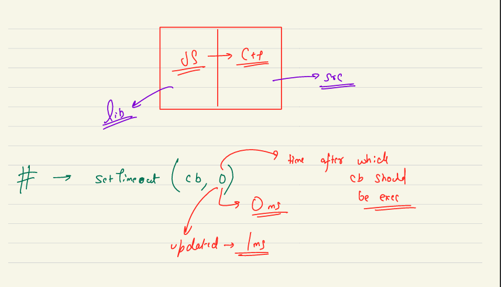

Great! Let's add this case study to your notes. We'll include it under a new section dedicated to case studies and ensure it's clearly structured.

# Node.js Notes

## Table of Contents
1. [Introduction to Node.js](#introduction-to-nodejs)
   - [What is Node.js?](#what-is-nodejs)
   - [What Node.js is Not](#what-nodejs-is-not)
   - [Internals of Node.js](#internals-of-nodejs)
   - [How Node.js Code is Written](#how-nodejs-code-is-written)
2. [Chrome V8 Engine](#chrome-v8-engine)
   - [Internals of V8 Engine](#internals-of-v8-engine)
3. [Case Studies](#case-studies)
   - [setTimeout(cb, 0)](#settimeoutcb-0)

## Introduction to Node.js

### What is Node.js?

Node.js is an open-source, cross-platform runtime environment that allows JavaScript to be executed outside of a web browser. It enhances JavaScript's capabilities by providing access to system resources and enabling server-side development.

#### Runtime Environment
A runtime environment is software that enhances the capabilities of a corresponding technology. In this case, the technology is JavaScript, a modern programming language. JavaScript inherently lacks certain capabilities, such as accessing timers or system resources. The runtime environment provides these extra capabilities.

#### Examples of Runtime Environments
- **Browsers**: Provide capabilities like timers, reading and modifying HTML, and making network calls (e.g., `fetch` function).
- **Node.js**: Provides capabilities like reading/writing files, accessing processes running in RAM, and setting up networking for server-side development.

#### History and Development
- **2009**: Ryan Dahl created Node.js to take JavaScript out of the browser and provide a new runtime environment with OS-level capabilities.
- **Capabilities**: Read/write files, access system processes, make networking calls, and set up servers.

### What Node.js is Not

Node.js is not:
- Limited to client-side development.
- Restricted to a single operating system (it is cross-platform).
- A programming language (it is a runtime environment for JavaScript).

### Internals of Node.js

Node.js provides various capabilities through its components:
- **V8 Engine**: Executes JavaScript code.
- **libuv Library**: Provides asynchronous I/O operations.
- **Event Loop**: Manages asynchronous callbacks.
- **OS-Level Access**: Allows interaction with the operating system.

#### Components of Node.js
- **libuv**: Optimized for specific tasks.
- **V8 Engine**: Compiles and executes JavaScript.
- **Event Loop**: Handles non-blocking I/O operations.

### How Node.js Code is Written

Node.js code interacts with the Node.js ecosystem through layers:
- **JS Layer**: Contains JavaScript functions exposed by Node.js.
- **C++ Layer**: Majority of the Node.js runtime is written in C++.

#### Example
```javascript
setTimeout(() => {
  console.log('This is executed after a delay');
}, 1000);
```
- **JS Layer**: `setTimeout` function.
- **C++ Layer**: Underlying implementation of `setTimeout`.

## Case Studies

### setTimeout(cb, 0)

The `setTimeout` function in JavaScript allows you to execute a callback function after a specified delay. When you pass `0` as the delay, it means the callback should execute immediately. However, the actual behavior can vary depending on the runtime environment.

#### Behavior Analysis
- **Timer Value**: When `setTimeout(cb, 0)` is called, the timer value is set to `0` milliseconds.
- **Runtime-Specific Behavior**: In some runtime environments, including certain versions of Node.js, passing `0` milliseconds as the delay may be internally converted to `1` millisecond. This behavior can be observed in the official codebase and may vary from one runtime to another.

#### Example
```javascript
setTimeout(() => {
  console.log('Callback executed');
}, 0);
```

#### Explanation
- **Immediate Execution**: The callback is intended to execute immediately after the current execution context.
- **Minimum Delay**: Some runtime environments enforce a minimum delay of `1` millisecond to ensure proper scheduling and execution of the callback.

#### Official Codebase
To verify this behavior, you can check the official Node.js codebase. Look for the implementation of `setTimeout` and observe how the delay value is handled when `0` is passed.

---
## V8 Engine
