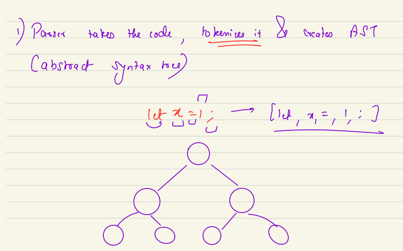

## Table of Contents
1. [Introduction to Node.js](#introduction-to-nodejs)
   - [What is Node.js?](#what-is-nodejs)
   - [What Node.js is Not](#what-nodejs-is-not)
   - [Internals of Node.js](#internals-of-nodejs)
   - [How Node.js Code is Written](#how-nodejs-code-is-written)
     - [Case Study: setTimeout(cb, 0)](#case-study-settimeoutcb-0)
2. [Chrome V8 Engine](#chrome-v8-engine)
   - [What is a JavaScript Engine?](#what-is-a-javascript-engine)
   - [Why Different JavaScript Engines?](#why-different-javascript-engines)
   - [How V8 Engine Executes JavaScript](#how-v8-engine-executes-javascript)
   - [Components of V8 Engine](#components-of-v8-engine)
     - [Parser](#parser)
     - [Interpreter (Ignition)](#interpreter-ignition)
     - [Compiler (TurboFan)](#compiler-turbofan)
   - [Just-In-Time (JIT) Compilation](#just-in-time-jit-compilation)
   - [Memory Management and Garbage Collection](#memory-management-and-garbage-collection)

## Introduction to Node.js

### What is Node.js?

Node.js is an open-source, cross-platform runtime environment that allows JavaScript to be executed outside of a web browser. It enhances JavaScript's capabilities by providing access to system resources and enabling server-side development.

#### Runtime Environment
A runtime environment is software that enhances the capabilities of a corresponding technology. In this case, the technology is JavaScript, a modern programming language. JavaScript inherently lacks certain capabilities, such as accessing timers or system resources. The runtime environment provides these extra capabilities.

#### Examples of Runtime Environments
- **Browsers**: Provide capabilities like timers, reading and modifying HTML, and making network calls (e.g., `fetch` function).
- **Node.js**: Provides capabilities like reading/writing files, accessing processes running in RAM, and setting up networking for server-side development.

#### History and Development
- **2009**: Ryan Dahl created Node.js to take JavaScript out of the browser and provide a new runtime environment with OS-level capabilities.
- **Capabilities**: Read/write files, access system processes, make networking calls, and set up servers.

### What Node.js is Not

Node.js is not:
- Limited to client-side development.
- Restricted to a single operating system (it is cross-platform).
- A programming language (it is a runtime environment for JavaScript).

### Internals of Node.js

Node.js provides various capabilities through its components:
- **V8 Engine**: Executes JavaScript code.
- **libuv Library**: Provides asynchronous I/O operations.
- **Event Loop**: Manages asynchronous callbacks.
- **OS-Level Access**: Allows interaction with the operating system.

#### Components of Node.js
- **libuv**: Optimized for specific tasks.
- **V8 Engine**: Compiles and executes JavaScript.
- **Event Loop**: Handles non-blocking I/O operations.

### How Node.js Code is Written

Node.js code interacts with the Node.js ecosystem through layers:
- **JS Layer**: Contains JavaScript functions exposed by Node.js.
- **C++ Layer**: Majority of the Node.js runtime is written in C++.

#### Example
```javascript
setTimeout(() => {
  console.log('This is executed after a delay');
}, 1000);
```
- **JS Layer**: `setTimeout` function.
- **C++ Layer**: Underlying implementation of `setTimeout`.

#### Case Study: setTimeout(cb, 0)

The `setTimeout` function in JavaScript allows you to execute a callback function after a specified delay. When you pass `0` as the delay, it means the callback should execute immediately. However, the actual behavior can vary depending on the runtime environment.

**Behavior Analysis**
- **Timer Value**: When `setTimeout(cb, 0)` is called, the timer value is set to `0` milliseconds.
- **Runtime-Specific Behavior**: In some runtime environments, including certain versions of Node.js, passing `0` milliseconds as the delay may be internally converted to `1` millisecond. This behavior can be observed in the official codebase and may vary from one runtime to another.

**Example**
```javascript
setTimeout(() => {
  console.log('Callback executed');
}, 0);
```

**Explanation**
- **Immediate Execution**: The callback is intended to execute immediately after the current execution context.
- **Minimum Delay**: Some runtime environments enforce a minimum delay of `1` millisecond to ensure proper scheduling and execution of the callback.

**Official Codebase**
To verify this behavior, you can check the official Node.js codebase. Look for the implementation of `setTimeout` and observe how the delay value is handled when `0` is passed.

## Chrome V8 Engine

### What is a JavaScript Engine?

A JavaScript engine is a software component that executes JavaScript code. It takes JavaScript code as input and produces machine code as output, which can be executed by the computer's processor. The JavaScript engine is responsible for parsing, interpreting, and compiling JavaScript code.

### Why Different JavaScript Engines?

Different JavaScript engines optimize for different use cases. For example:
- **High-End Machines**: Browsers generally run on high-end machines.
- **Low-End Devices**: IoT devices have limited capabilities and require different optimizations.

### How V8 Engine Executes JavaScript

1. **Parsing**: The parser tokenizes the JavaScript code and creates an AST.
2. **Interpreting**: The Ignition interpreter converts the AST to bytecode and starts executing it.
3. **Compiling**: The TurboFan compiler optimizes the bytecode based on runtime information, such as frequently executed functions.

### Components of V8 Engine

The V8 engine is a JavaScript engine developed by Google. It is used in both the Chrome browser and Node.js to execute JavaScript code. V8 is one of several JavaScript engines available, with others including Chakra and SpiderMonkey.

#### Parser

The parser is the first component of the V8 engine. It takes the JavaScript code, tokenizes it, and creates an Abstract Syntax Tree (AST).

- **Function**: Tokenizes the code and creates an AST.
- **Example**: When you write `let x = 1;`, the parser tokenizes this code and converts it into a parse tree.
- **Purpose**: Makes the code understandable for the remaining components of the V8 engine and enables later optimizations.

#### Interpreter (Ignition)

The interpreter, named Ignition, converts the AST to bytecode, an intermediate form of code.

- **Function**: Converts the AST to bytecode.
- **Execution**: Starts running the bytecode.
- **Purpose**: Provides a quick, unoptimized execution of the code.

**Detailed Explanation**:
Ignition creates a short bytecode or unoptimized version of your code. Once you start running this bytecode, the V8 engine starts collecting runtime metrics or runtime information about which particular functions are getting executed repeatedly. Based on these runtime metrics, the V8 engine optimizes your code. To optimize the code, it uses a compiler called TurboFan, which is an optimization compiler.

#### Compiler (TurboFan)

TurboFan is a compiler optimization specifically designed to create highly optimized machine code. It performs various types of checks and optimizations based on past runs of the code.

- **Function**: Optimizes the bytecode to create highly optimized machine code.
- **Purpose**: Improves performance by caching and optimizing frequently executed code.

**Detailed Explanation**:
TurboFan can perform different types of checks. For example, if a line of code is executed repeatedly, it can cache those lines. If you pass an object to a function, TurboFan can create a type representation for that object. This means it doesn't have to recreate the type representation repeatedly, optimizing the process.

**Example**:
If you pass an object with a key `name` and a string value to a function repeatedly, TurboFan will create a cached version of this object type. However, if you later pass a different object, TurboFan can fall back to the previous unoptimized code.

**Optimization Process**:
1. **Initial Execution**: Ignition executes the bytecode and collects runtime metrics.
2. **Optimization**: Based on these metrics, TurboFan creates optimized machine code.
3. **Fallback Mechanism**: If the assumptions made during optimization are invalidated (e.g., passing a different object type), TurboFan can fall back to the unoptimized code.

**Benefits**:
- **Efficient Execution**: Directly uses optimized machine code based on past executions.
- **Adaptability**: Can revert to unoptimized code if necessary, ensuring robustness.

### Just-In-Time (JIT) Compilation

Just-In-Time (JIT) compilation is a mechanism where the compilation and interpretation of code happen at runtime. This is in contrast to Ahead-Of-Time (AOT) compilation, where the code is compiled before execution.

#### Types of Compilation
1. **Ahead-Of-Time (AOT) Compilation**:
   - **Example**: C++ code is compiled before it is run.
   - **Process**: The code is compiled into machine code before execution.

2. **Just-In-Time (JIT) Compilation**:
   - **Example**: Most JavaScript engines, including V8, use JIT compilation.
   - **Process**: The code is compiled and executed simultaneously at runtime.

#### How JIT Works
- **Initial Execution**: The interpreter (Ignition) starts executing the bytecode.
- **Runtime Metrics**: The engine collects runtime metrics to identify frequently executed code paths.
- **Optimization**: Based on these metrics, the JIT compiler (TurboFan) optimizes the bytecode into highly optimized machine code.
- **Fallback Mechanism**: If the optimized code becomes invalid (e.g., due to changes in the execution environment), the engine can fall back to the unoptimized bytecode.

#### Benefits of JIT
- **Adaptability**: Can optimize code based on real-time execution patterns.
- **Efficiency**: Reduces the need for extensive pre-compilation, allowing for more dynamic optimizations.
- **Performance**: Optimizes frequently executed code paths, improving overall performance.

### Memory Management and Garbage Collection

Apart from providing capabilities like parsing, interpreting, and compiling, the V8 engine also manages memory and performs garbage collection.

#### Memory Management
- **Access to Call Stack and Heap**: V8 provides access to the call stack and heap, allowing JavaScript code to manage memory effectively.
- **Garbage Collection**: V8 uses an algorithm called the Orinoco algorithm for garbage collection.

#### Orinoco Algorithm
- **Overview**: The Orinoco algorithm is a garbage collection algorithm that combines young and old generation segregation.
- **Young and Old Generation**:
  - **Young Generation**: Newly created objects are classified as young generation. These objects are more likely to become unnecessary quickly.
  - **Old Generation**: Objects that survive multiple garbage collection cycles are promoted to the old generation.
- **Garbage Collection Cycles**:
  - Orinoco performs multiple garbage collection cycles to collect unnecessary objects.
  - If an object survives multiple cycles, it is classified as an old generation object.
- **Parallel Execution**: The garbage collection process runs in parallel with JavaScript execution, ensuring that it does not block the main thread.
- **Memory Compaction**: Orinoco also performs memory compaction to reduce fragmentation, ensuring efficient memory usage.

**Benefits**:
- **Efficient Memory Management**: Ensures that memory is used efficiently without blocking JavaScript execution.
- **Adaptability**: Can handle both young and old generation objects effectively.
- **Performance**: Improves overall performance by reducing memory fragmentation and ensuring efficient garbage collection.

---
## Useful Links

1. [Talk 2: Ignition - an interpreter for V8](https://www.youtube.com/watch?v=r5OWCtuKiAk)  
2. [Node.js GitHub](https://github.com/nodejs/node/blob/main/lib/timers.js)  
3. [ECMAScript® 2025](https://tc39.es/ecma262/)  
4. [Presentation](https://docs.google.com/presentation/d/1OqjVqRhtwlKeKfvMdX6HaCIu9wpZsrzqpIVIwQSuiXQ/edit#slide=id.g1453eb7f19_1_131)  
5. [The Orinoco Garbage Collector](https://v8.dev/blog/trash-talk)  


